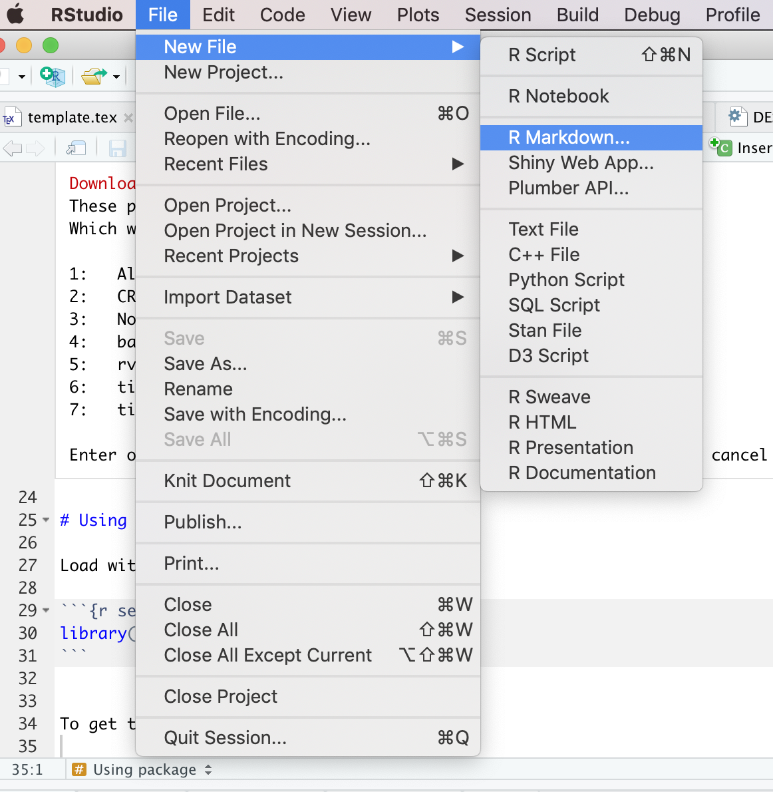
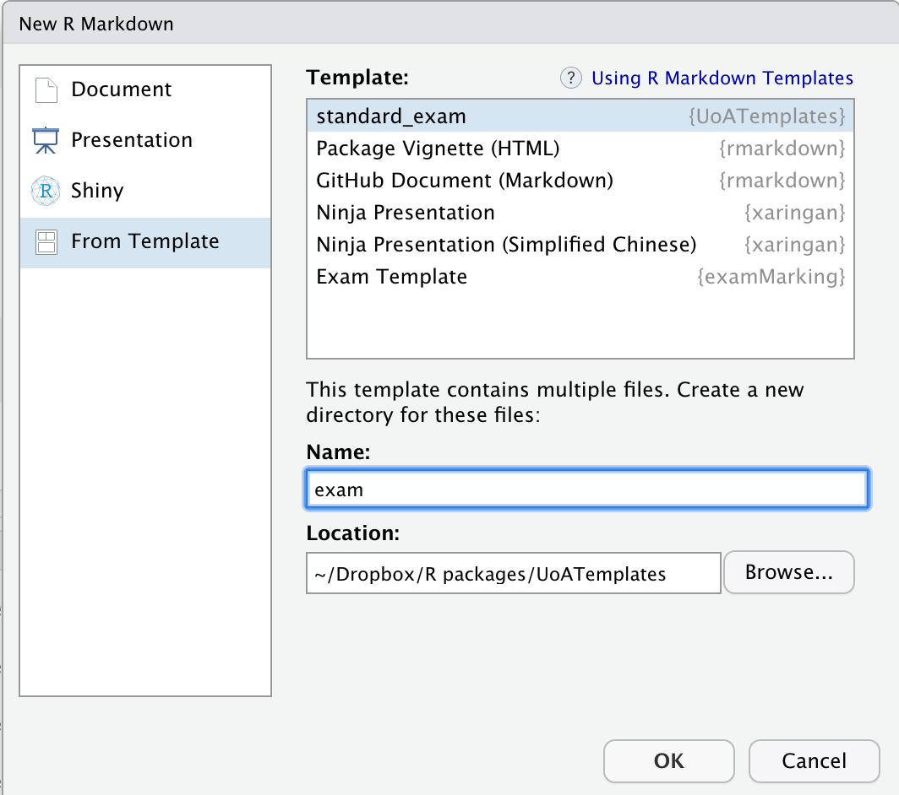

```{r, include = FALSE}
knitr::opts_chunk$set(
  collapse = TRUE,
  comment = "#>"
)
```

# Installing

Use `devtools` to get from github:

```{r, eval = FALSE}
devtools::install_github("jonotuke/UoATemplates")
```

# Using package

Load with the usual:

```{r setup}
library(UoATemplates)
```


To get template, then use

```
File > New File > R Markdown...
```

```{r, out.width="50%", echo = FALSE}

```

Then use `From Template` and `standard_exam`. 


```{r, out.width="50%", echo = FALSE}

```


